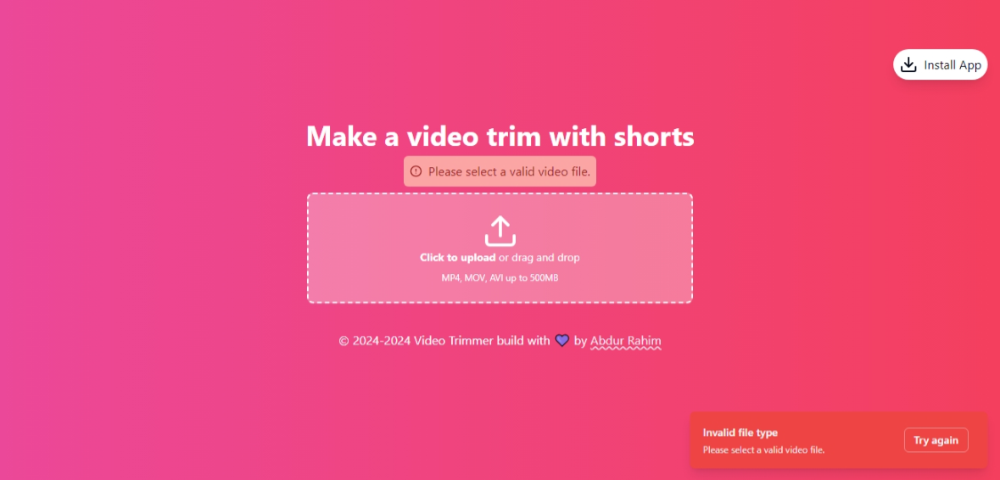

# Video Trimmer

A simple video trimmer built with React, Tailwind CSS, and shadcn/ui. 

## Features

- Upload video files
- Trim videos to desired length
- Real-time preview of trimmed video
- Download trimmed video
- Responsive design
- PWA(Progressive Web App) support

## Technologies Used

- React
- TypeScript
- Tailwind CSS
- shadcn/ui
- FFmpeg (for video processing)

## Getting Started

### Prerequisites

- Node.js (v14 or later)
- npm or yarn

### Installation

1. Clone the repository:
   ```
   git clone https://github.com/your-username/video-trimmer.git
   ```

2. Navigate to the project directory:
   ```
   cd video-trimmer
   ```

3. Install dependencies:
   ```
   npm install
   ```
   or
   ```
   yarn install
   ```

4. Start the development server:
   ```
   npm run dev
   ```
   or
   ```
   yarn dev
   ```

5. Open your browser and visit `http://localhost:3000`

## Usage

1. Click on the "Upload Video" button to select a video file.
2. Once the video is loaded, use the slider to set the start and end points for trimming.
3. Click the "Trim Video" button to process the video.
4. After processing, you can preview the trimmed video and download it.


## Screenshots





## Acknowledgements

- [FFmpeg](https://ffmpeg.org/) for video processing capabilities
- [shadcn/ui](https://ui.shadcn.com/) for UI components
- [Tailwind CSS](https://tailwindcss.com/) for styling


## Connect on Social Media
- [Twitter](https://twitter.com/AbdurRahim4G)
- [Instagram](https://www.instagram.com/abdurrahim4g/)
- [Facebook](https://www.facebook.com/Rahim72446)
- [LinkedIn](https://www.linkedin.com/in/abdur-rahim4g/)
- [YouTube](https://youtube.com/@AbdurRahimm)

Created with 💜 by [Abdur Rahim](https://github.com/AbdurRaahimm)

